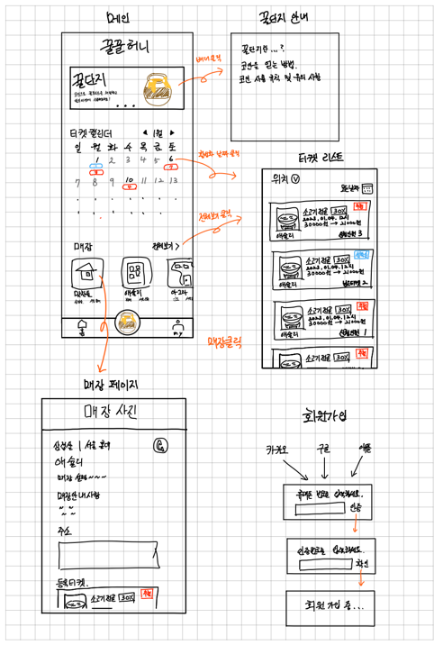
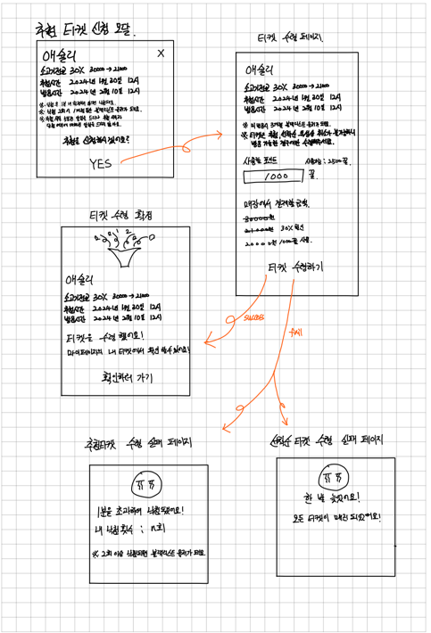
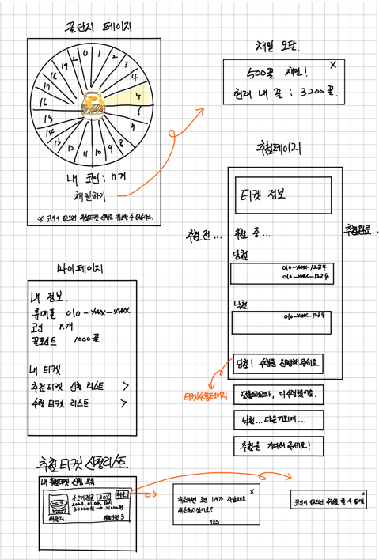

# 꿀꿀허니

# 개요

기상 이슈, 행사, 공휴일 등 다양한 이벤트로 인하여 고객 수요가 급격하게 낮은 일시에도 많은 식당은 주도적인 조치가 불가능.

재고가 남거나, 빈 테이블이 발생하는 문제를 해결하기 위해 할인제도를 적용할 수 있는 플랫폼을 제작하고자 함.

# 요약

- C2C 플랫폼
    - 레스토랑 티켓 생성 솔루션
    - 추첨티켓, 선착순티켓 중개 시스템
- BM
    - 티켓 생성 가능 수량에 따른 솔루션 이용료 (고도화 단계)
        - ex) 매달 100개 생성 시 4900원, 300개 생성시 9900원 …
    - 배너 광고 (고도화 단계)
- 고객 수요 예측, 판매량 추천, 판매일시 추천 등의 AI 기능 제공 (고도화 단계)

# 목표

- 5개 매장 유치
- 가입 유저 50 (매장 사용자 제외)
- MAU 500 (매장 사용자 제외)

# 메타포

- 사용자
    1. 방문자
    2. 점주
- 운영자
    - BackOffice 유저
- 꿀단지
    - 포인트를 발급해주는 랜덤뽑기 기계
- 꿀포인트
    - 포인트를 지칭
- 코인
    - 1코인당 꿀단지 1회 실행 가능
- 추첨 티켓
    - 한 티켓당 여러명 신청을 받고, 지정된 시간에 랜덤으로 티켓을 수령할 유저를 추첨하는 티켓
- 선축순 티켓
    - 티켓 수령 제한 인원까지 선착순으로 제공되는 티켓

## 목업

